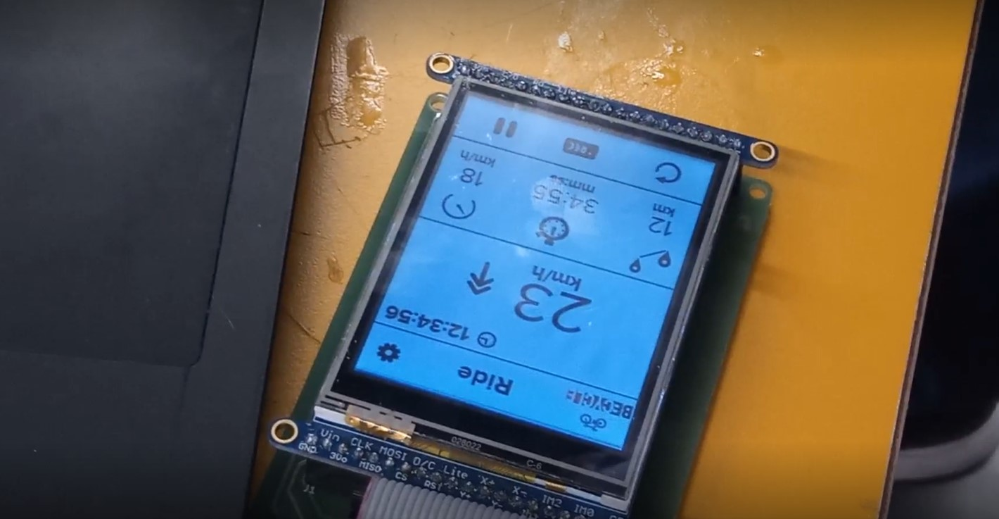
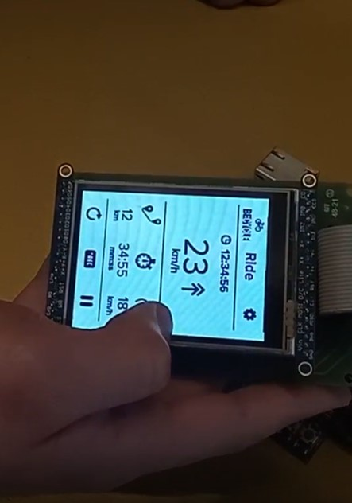
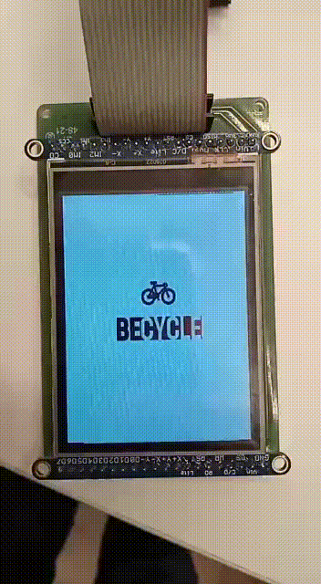

# 21b - APS2 - Embarcados

O marketing de uma empresa de equipamentos esportivos quer criar um novo ciclocomputador e você foi escolhido como desenvolvedor autônomo, dado seu background técnico e de UX, para criar um protótipo e validar a ideia.

Mais detalhes no site da disciplina:

- https://insper.github.io/ComputacaoEmbarcada/navigation/APS/APS-2-Bike/Descricao/

## Detalhes

Integrantes:

- Letícia Coêlho
- Lorran Lopes
- Lister Ribeiro

Nome da marca:

- BeCycle 

</img>

## Interface

### Proposta UX 1 - C
Descricão da primeira proposta da interface:

- Imagem da proposta: 

</img>

- Imagem da proposta no LCD: 

</img>

- Vídeo explicando a interface: https://alinsperedu-my.sharepoint.com/:v:/g/personal/lorrancml_al_insper_edu_br/EdkpyNuwfBpBllGnrawMWQUBveybnjv6hNb0As1sc1C3Sg?e=BQiP9L

### Proposta UX 2 - B

Detalhes da segunda interação da proposta de interface:

<!-- 
 Adicionar texto descrevendo a evolução 
 da interface
-->
- Fontes e tamanhos: a fonte escolhida foi a Cascadia Code, em 3 tamanhos: P, M e G. A escolha da fonte se deve ao fato de ela ser utilizada nos terminais de comando do Microsoft Windows, que detem mais de 76% do mercado de sistemas operacionais de desktops. Então, a escolha busca criar uma familiaridade com o usuário. 
#### Mudanças sugeridas pelo LUIZ: 
- Opção de alterar unidade da velocidade mostrada (milhas/hora)
- Drop down com possíveis tamanhos de aro (medidas normalmente em polegadas ou milímetro)
- Alterar cor de fundo para branco , para maior contraste
- Icone de acelerar ou desacelerar "colorido" verde/vermelho (auxilio visual)

- Imagem da proposta:

</img>

- Imagem da proposta no LCD: 

</img>

- Vídeo explicativo: https://alinsperedu-my.sharepoint.com/:v:/g/personal/lorrancml_al_insper_edu_br/Ef7LpS-XtGtHgFJdoI-nnlcBDtCAWLhO4IVfrB1vLdf7gQ?e=DnuHbQ
- Vídeo da entrevista: https://alinsperedu-my.sharepoint.com/:v:/g/personal/lorrancml_al_insper_edu_br/EYOF0LEiglJJle5L3MUPjOoB8Faimvwvy1pve3nki-HOOg?e=f2Mc2T

### Proposta UX 3 - A

Detalhes da terceira interação da proposta de interface:

<!-- 
 Adicionar texto descrevendo a evolução 
 da interface
-->

- Imagem da proposta: não houve alterações. Detalhes apresentados no vídeo explicativo. 
- Imagem da proposta no LCD: 

</img>

- Vídeo explicativo: https://alinsperedu-my.sharepoint.com/:v:/g/personal/lorrancml_al_insper_edu_br/EWyWmf7kLURMu72xYrMihvsB-D_SASyCjj88AWJh0NdX7Q?e=2vPkE1
- Vídeo da entrevista: https://alinsperedu-my.sharepoint.com/:v:/g/personal/lorrancml_al_insper_edu_br/EcXFIsi3_6lCpo457zidFIYB4tOqF8yySVvWWhgt1G_7GA?e=WPgvr2
